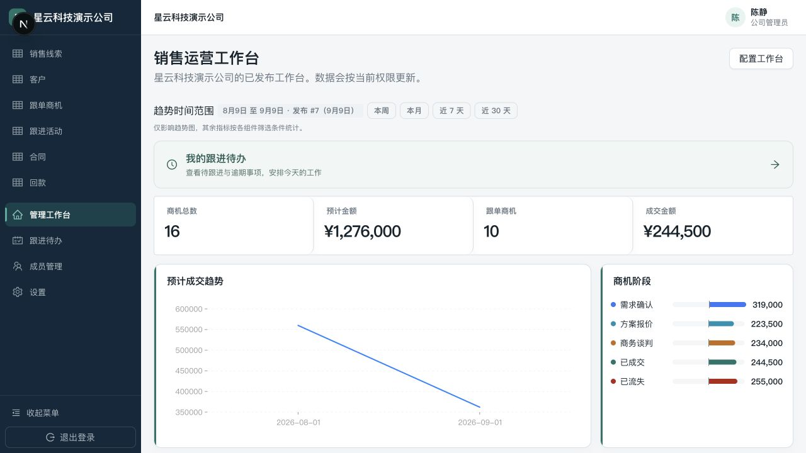
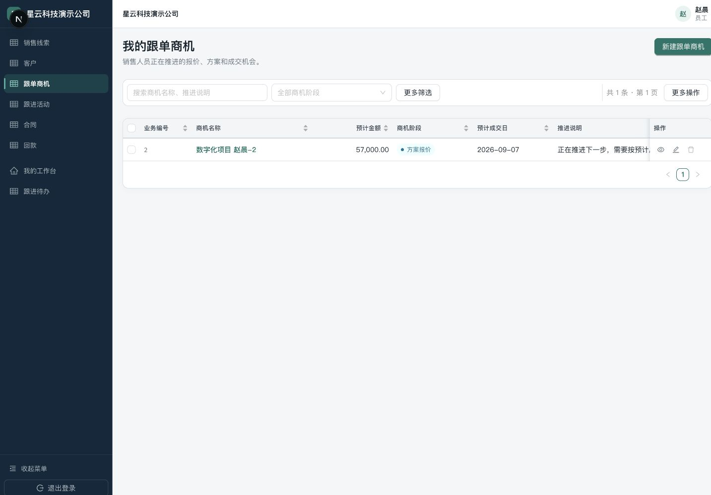
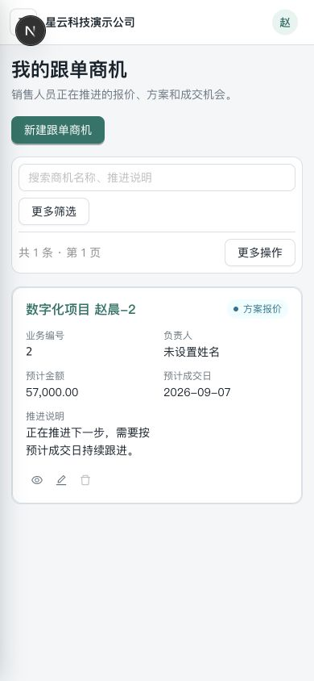
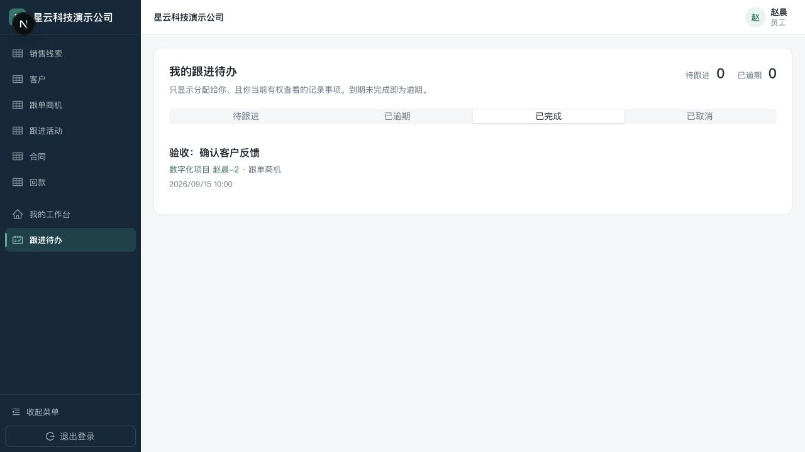

# 2026-09-09 CRM 修复与页面调整验收

本轮交付位于 `codex/crm-polish-followups` 工作区，基于 `297ad7a`。本轮开始时 main 与 origin/main 同步；本轮没有提交、push 或部署。短信与 AI 按用户要求延后。

## 已处理

- 权限与数据：员工普通编辑保留原负责人；禁止发布员工隐藏的标题字段；既有不安全发布在运行时拒绝暴露。CSV 防公式执行；前端只重试失败行，服务端批次记录保证网络重试与并发重试不会重复写入。
- 看板：修正演示模板的阶段条件；正常保存并发布本地 nebula-demo 配置（发布 #7），无破坏性重置。管理员看到商机 16、进行中 10、预计金额 1,276,000、成交金额 244,500。明确日期范围只影响趋势。
- 样式：保留深色导航与低饱和青绿色主色，统一控件 8px、卡片 12px；表格金额右对齐、选项标签、次要筛选折叠、紧凑操作；390px 下以记录卡片呈现，修复工具栏溢出。记录抽屉关闭返回列表时保留筛选。
- 平台：公司名称/代码/状态真实服务端筛选；开通步骤区分管理员接受、有效管理员、发布对象及公司状态；首位管理员过期邀请可同手机号受控续期，有审计、并发锁和状态校验。移除平台管理员直达无权租户设置的入口；平台操作页明确现有记录范围。
- 个人跟进：在可查看且可更新的记录详情为自己安排时间；个人入口筛选待跟进、逾期、完成、取消；支持改期，完成/取消保留记录。每次操作重新校验租户、记录权限与所属范围，并用记录锁及版本号防止转移负责人和重复完成的并发问题。

角色边界仍清晰：超级管理员负责公司开通、生命周期、平台模板和运营；公司管理员负责本公司成员、业务配置和发布；员工只能操作获授权的数据。超级管理员不会因此自动获得各公司业务数据权限。

## 验证

- 全仓 `pnpm typecheck` 通过；API `nest build` 通过。
- Web 全量 59 个测试文件、344 个测试通过（maxWorkers=2）。首次默认并发运行发现旧导航/token 断言和一个模板编辑器超时；修正断言后以较低并发全量通过。
- 全量 Web 之后新增抽屉关闭/重开与切换版本的 2 项回归测试并聚焦通过；本轮新增代码 lint 问题已修复。API 改动文件仍有 8 条 HEAD 已存在的 lint（JSON 值字符串化/旧测试 matcher 类型），未将全量 lint 声称为通过。
- 聚焦 API 回归及租户测试通过；独立 PostgreSQL 数据库三项 E2E 覆盖记录隔离、CSV 并发幂等/失败纠正、跟进转移竞态、空权限范围与并发完成。临时数据库已移除。
- 本地与全新测试库均已应用全部 13 个迁移，新增 0012 导入幂等和 0013 跟进待办；OpenAPI 与生成客户端已更新。
- 本地真实 API 验收：员工创建过去日期事项 → 逾期计数 1 → 改期解除逾期 → 完成，版本依次 1/2/3。保留一项标题带“验收”的已完成演示事项。
- 浏览器实看公司管理员首页、员工记录表、抽屉及个人待办；桌面与390px手机截图见下。原生日期控件的浏览器自动 fill 不兼容，创建/改期以组件测试和真实 API 验收；完成列表在浏览器确认可见。
- 平台页面本轮由组件/服务测试与代码审核验证；没有使用超级管理员凭据做完整浏览器人工走查，不将其声称为已完成的端到端验收。
- 本轮未运行 Web 生产构建；本地 Next.js 开发页面和类型检查正常。生产部署不在本轮范围。

## 当前边界

逾期的定义是“截止时间已过且状态仍为待跟进”，只在页面显示，不自动联系客户。没有短信、飞书消息、后台催办、团队派单或自动业务状态迁移。现有活动的 nextActionAt 不自动生成待办，避免误造重复事项及修改历史。

这轮解决已确认问题并打通最小跟进闭环，不代表完整 CRM 或生产就绪；对象关系、状态转换、团队任务、生产短信及运维仍是后续事项。

## 页面截图

