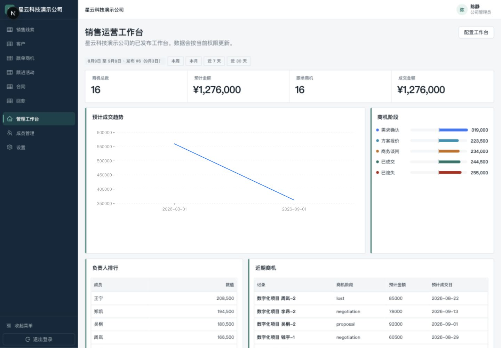
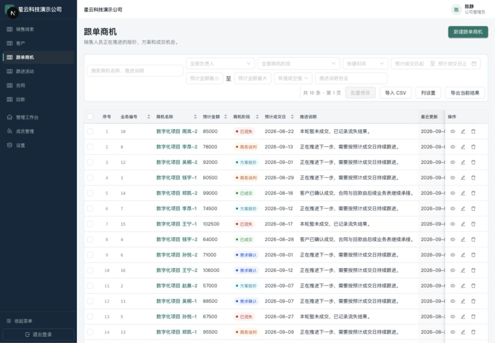
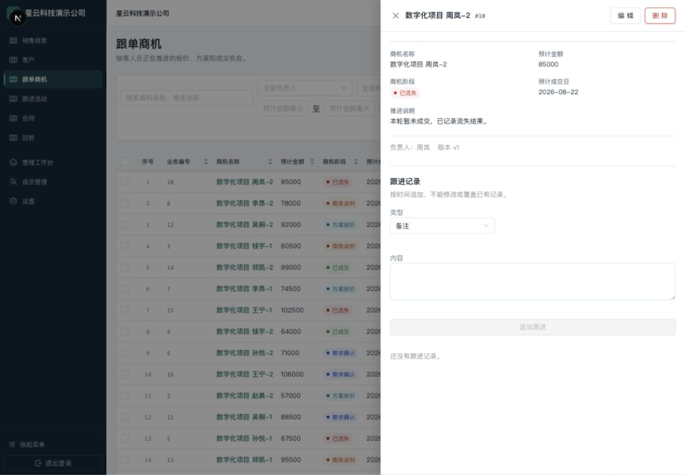
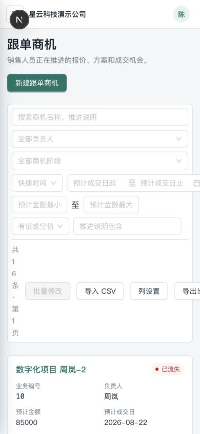
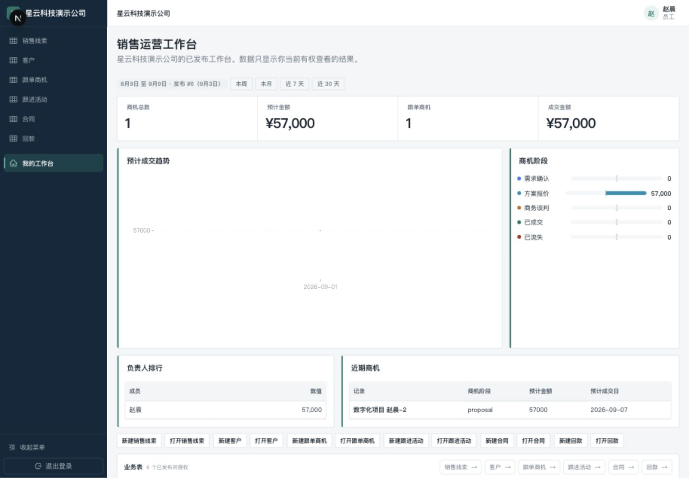

# CRM 进度、逻辑、体验与 AI 接入审核

审核日期：2026-09-09。代码基线：`main / 297ad7a`。本报告是现状审核和设计建议，没有修改业务代码、发布配置或业务记录，也没有提交、推送或部署。

当前判断：可配置平台和表管理主干已实现，适合继续内部试用；销售业务闭环与生产交付条件尚未齐备。不能用页面数量或一个百分比代替验收。

## GitHub 与进度事实

- 执行 `git fetch origin` 后，`git rev-list --left-right --count HEAD...origin/main` 为 `0 0`。本地和远端均为 `297ad7a`，最新提交日期 2026-09-07，内容为 CSV 字段映射导入。
- GitHub 仓库 `Zhong0118/multi-tenant-CRM-builder` 当前公开，默认分支 main；本次 `gh run list --limit 5` 没有返回 Actions 运行记录。代码已上传不等于部署或 CI 验收。
- 本地未跟踪内容包括部分 v2/v3 设计稿、超级管理员页面规范、chat 会话、CodeGraph/zvec/工作树工具目录。它们尚未被当前分支提交。
- HANDOFF 开头“未推送、领先约49个提交”、README 的部分“尚未实现”条目与当前代码不一致。导入、导出、活动、批量修改均已有实现，应更新交接文档并保留单一状态清单。
- 当前跟踪的环境文件只有 `.env.example`；这不是完整 Git 历史密钥扫描。公开仓库中的本地演示账号资料不应当成为任何正式环境凭据。

## 完成度

| 模块 | 当前可用能力 | 未完成或限制 |
|---|---|---|
| 身份与租户 | 登录、注册、找回密码、会话、邀请接受、公司启停、成员和多工作区 | 真实短信；全新公司开通全链路人工验收记录 |
| 配置引擎 | 12类字段、对象草稿/发布快照、默认列表、动作/范围/字段权限 | 关系、公式/汇总、状态机、版本回滚 |
| 业务记录 | CRUD、搜索、类型筛选、排序、软删除、乐观锁、活动时间线 | 待办/逾期/下次跟进执行闭环、转换、去重合并、真实附件 |
| 表管理 | CSV映射导入500行、导出5000行、批量修改50行、本机个人列设置 | xlsx、按主键更新、可靠重试幂等、命名个人视图、跨设备列设置 |
| 模板与工作台 | 模板发布/初始化、多工作台、五类组件、按权限真实查询 | 指标配置口径错误、时间范围表达不准确；模板升级同步 |
| 运营与上线 | 平台审计、部分运营状态页、API/Worker工程边界 | 真实任务中心、租户审计/统计/导入导出中心占位、生产运维验收 |
| AI与集成 | 领域语言已定义 Integration Identity，存在集成模块骨架 | 集成服务为空；没有AI执行、审批、事件自动化的完整实现 |

模板不是公司使用 CRM 的前置条件。平台管理员负责开通、模板和公司生命周期；公司管理员配置并发布业务表；员工按已发布权限使用记录。首家公司特有流程仍应落在模板/规则配置中。

## Standards：代码正确性与权限

### S1 · P1：隐藏标题字段仍可读

位置：[records.service.ts:1192](/Users/zhongxu/Desktop/0-Inbox/multi-tenant-CRM-builder/apps/api/src/modules/records/records.service.ts:1192)，搜索入口为 [records.repository.ts:596](/Users/zhongxu/Desktop/0-Inbox/multi-tenant-CRM-builder/apps/api/src/modules/records/records.repository.ts:596)。

管理员把标题字段设为员工 HIDDEN 后，schema.fields 与 values 会裁剪该字段，但响应仍直接返回衍生的 `record.title`，关键词查询也仍搜索标题。真实发布分析对这个草稿返回 `blocking:[]、warnings:[]`，因此不是不可达配置。

内存验证：员工读取返回 `values:{score:12}`，同时仍返回 `title:"Memory test record"`。应在服务端禁止隐藏标题，或把标题输出、搜索、工作台等衍生路径一起纳入权限投影。

### S2 · P1：员工编辑会静默改变负责人

位置：[records.service.ts:628](/Users/zhongxu/Desktop/0-Inbox/multi-tenant-CRM-builder/apps/api/src/modules/records/records.service.ts:628)。

员工A拥有 UPDATE ALL 时，可以修改负责人为B的记录。但 `resolveUpdateOwner()` 对员工直接返回A，即使请求中没有 `ownerMemberId`。实际调用服务，仅传 `{version:1,values:{score:12}}`，负责人从B变成A并被持久化。影响分配、员工业绩和B的 OWN 可见性。

修正应区分新建和修改：修改未提交转交时保留原负责人；显式转交另行检查动作权限。

### S3 · P1：部分成功导入再次提交会复制成功行

位置：[record-import.tsx:73](/Users/zhongxu/Desktop/0-Inbox/multi-tenant-CRM-builder/apps/web/src/features/records/record-import.tsx:73)。

导入两行，一行合法、一行缺少必填字段。成功行已落库，抽屉保持打开，导入按钮可继续点击；再次提交依然发送所有 `parsed.rows`，后端每次生成新ID和编号。用户修正映射后重试，会重复创建之前成功的记录。

应提供“仅重试失败行”，同时增加服务端导入批次/行幂等键，覆盖请求超时但服务器实际已提交的情况。只有前端禁用按钮不足以处理网络重试。

### S4 · P2：CSV 不可信文本可以成为公式

位置：[record-export.ts:120](/Users/zhongxu/Desktop/0-Inbox/multi-tenant-CRM-builder/apps/api/src/modules/records/record-export.ts:120)。

真实导出函数对文本 `=1+1` 原样输出。当前处理只覆盖逗号、双引号、换行，没有对公式起始文本转义；在 Excel 等表格软件中可能按公式解释。应对文本、标题和成员名称做公式安全处理，并兼顾手机号前导零的保留。

本轴合计4项，最高严重度P1。正面证据：记录显式租户条件、OWN范围检查、普通隐藏字段投影、字段写入校验、version条件更新均存在。没有在本次范围确认跨租户绕过；不代表完整渗透测试通过。

## Spec：规格、指标与交付边界

### R1 · P1：演示工作台成交金额统计所有阶段

位置：[demo-company-fixture.ts:513](/Users/zhongxu/Desktop/0-Inbox/multi-tenant-CRM-builder/apps/api/src/scripts/demo-company-fixture.ts:513)。

共用配置 `filters:[]`，跟单商机和成交金额组件没有补充 active/won 阶段条件。管理员首页总数与跟单数都为16，预计与成交金额都为1,276,000；阶段图“已成交”只有244,500。员工首页同样把57000的“方案报价”列为成交金额，而已成交阶段为0。

这是演示配置错误，不是聚合函数算术错误。应按显式阶段字段绑定筛选，并核对金额代表预计额、合同额还是实收额。仅改 seed 不会自动修复现有不可变发布版，现有演示工作台需要正常修改草稿并重新发布。

### R2 · P2：统计区间只约束趋势

位置：[workbench-chrome.tsx:30](/Users/zhongxu/Desktop/0-Inbox/multi-tenant-CRM-builder/apps/web/src/features/dashboard/workbench-chrome.tsx:30)，[dashboards.repository.ts:683](/Users/zhongxu/Desktop/0-Inbox/multi-tenant-CRM-builder/apps/api/src/modules/dashboards/dashboards.repository.ts:683)。

顶部文案“统计区间”看起来作用于整页；实际只有趋势查询追加全局 period，其余 KPI、分布、排行和列表没有相同约束。短期应标成“趋势时间范围”，并说明其它指标的范围；长期为组件明确绑定日期字段，避免将预计成交日、实际成交日、回款日混为一谈。

### R3 · 生产阻断：真实短信尚未接入

[verification-sender.ts:30](/Users/zhongxu/Desktop/0-Inbox/multi-tenant-CRM-builder/apps/api/src/infrastructure/verification/verification-sender.ts:30) 在生产环境直接抛错，Provider初始化会失败。这是已声明的后续工作，不是新回归。不能直接设置 NODE_ENV=production 后当作正式可用系统。

### R4 · 跟进任务未形成闭环

`nextActionAt` 目前保存在活动中；[worker/main.ts:34](/Users/zhongxu/Desktop/0-Inbox/multi-tenant-CRM-builder/apps/worker/src/main.ts:34) 及本次启动日志都确认没有注册业务队列。不存在已完成的到期提醒、撤销、重试和完成状态逻辑。应先补任务模型和确定性调度，再接AI自动化。

### R5 · 独立功能中心仍是占位

租户侧 [audit/page.tsx:5](/Users/zhongxu/Desktop/0-Inbox/multi-tenant-CRM-builder/apps/web/src/app/(workspace)/workspace/[tenantCode]/audit/page.tsx:5)、statistics/page.tsx 和 import-export/page.tsx 使用 PagePlaceholder。记录列表内 CSV 功能已实现，不能据此说所有导入导出都未实现，也不能因存在中心路由就认为完成。

本轴合计5项：2项口径问题、3项明确交付缺口，最高问题严重度P1。

## 本轮界面走查

使用本地 `nebula-demo` 演示租户、管理员及员工账号。桌面1440×1000、窄屏390×844。截图均为本轮实时捕获并保存后检查；没有使用旧设计图代替运行页面。

### 1. 管理员首页：可用，但口径误导

保留深色侧栏、浅色工作区、紧凑KPI条。优先改成交指标、时间范围说明、状态枚举显示；“近期商机”不应直接显示 lost/negotiation/proposal 和未格式化金额。当前两点趋势占据很大画布，可以收紧图表高度，把需处理事项前移。公司名重复出现和“发布#6”等说明可弱化到配置入口。

### 2. 桌面记录列表：可用，工具栏拥挤

保留状态色标签、固定行操作、明确新建入口。搜索、负责人、阶段常驻，其余收进“更多筛选”；已生效条件显示可移除标签。将导入、导出、列设置放到表格工具区，与筛选分组。金额统一货币/千分位并右对齐；序号与业务编号可默认保留一个。长说明截断并可查看完整内容。删除放次级操作，减少误触。

### 3. 记录详情：能查看与追加，下一步不足

抽屉保留列表背景，字段分组清楚。将“追加跟进”做主要动作，把负责人和当前阶段放到摘要。需要新增“下次联系时间”和待办承接，而不只是备注历史。侧栏独立“跟进活动”业务表和记录内“跟进记录”尚无关系闭环，不要向用户暗示它们自动同步。版本信息可降级显示。

### 4. 手机记录列表：有卡片适配，工具栏失效

卡片有标题、状态、负责人和重要字段，这是正确方向。但日期和动作组超出390px视口，“共16条·第1页”被挤成逐字竖排。第一张卡片要到约690px才出现。应改为“搜索＋筛选按钮＋更多操作”，筛选走抽屉，计数独占稳定行；在390px验收无横向溢出、首屏能看到至少一条主要记录。

### 5. 员工首页：权限视图存在，工作安排感弱

本轮员工首页只有其可见的1条记录，管理员配置入口不显示。不要用只有一个点的巨大趋势图占据主区域；无足够趋势数据时用简洁说明。首页优先“今日待办、已逾期、最近联系、待审批”，再展示少量KPI；底部大量“新建/打开”成对按钮应收敛成常用入口。

截图和可访问性树只能提示低对比、小图标目标、单点图表、控件标签等风险；本轮没有完成对比度测量、完整键盘焦点循环和读屏验收，不能声称无障碍合规。

## AI接入建议

推荐形态：CRM内部小型工作流 + 模型总结/抽取能力 + 可选飞书通知审批入口。审批及执行真相保存在CRM内；模型只提出建议，业务服务执行。

### 权限边界

- 交互AI的读取权限 = 当前成员有效权限 ∩ 租户AI策略 ∩ 本次任务授权。继续执行对象、ALL/OWN/NONE、EDIT/READ_ONLY/HIDDEN限制，摘要和引用本身也需要同等级访问控制。
- 读取范围必须在数据送给模型前缩小；不能先给全公司数据，再靠提示词要求只看自己的记录。缓存、会话、检索索引、日志及生成摘要必须隔离租户和访问范围，权限变化后重新校验。
- 自动工作流使用独立、可撤销、有负责人及白名单范围的 Integration Identity。员工触发不能借用管理员权限；离职、停用、对象归档和权限撤销后，排队任务也要停止或重新授权。
- 模型不拿SQL、数据库管理员账号、任意HTTP、shell或直接“执行修改”工具。只给类型化工具，如 `search_records`、`get_record_summary_context`、`propose_record_change`。审批执行器拥有受限写能力，模型进程本身没有批准权限。
- 对外模型供应商、数据范围、敏感字段处理和保留设置由租户明确配置；先选少量可见字段和活动做摘要，保留来源与“不确定/缺失”状态。

### 人工审批不能只是聊天里说“同意”

先保存不可变提案：tenant、请求人、目标记录、对象发布版本、记录version、逐字段旧值→新值、理由和来源、提案hash、过期时间。用户看到具体差异后批准。

执行时核对审批者身份和业务权限、请求授权仍有效、记录版本未变化、提案未被改动及未执行过；变化时重新预览/审批，不能静默覆盖。使用幂等键与审计，状态区分待审批、拒绝、过期、执行中、成功、失败。AI不得自动改写批准过的payload或自批。字段不可写的人点“批准”也不能获得额外写权；若确需管理员越级决策，应是独立显式授权流程。

建议第一版所有业务新增/修改由有权限的人确认，但草稿/提案自身可自动保存到隔离区域，不影响正式记录。权限、负责人、金额、客户联络方式、成交状态和批量操作应单独列为高风险类别。

### 自动跟进是否合适

| 动作 | 建议 |
|---|---|
| 按已授权规则检查截止时间、生成内部提醒 | 可以自动，规则可停用，重新检查权限，做去重/频率/静默时段控制 |
| 总结最近沟通、准备待办/回复草稿 | 可以自动生成建议，展示来源，不自动把推测当事实 |
| 新增或修改正式业务信息 | 先预览差异再人工确认；首版沿用用户要求全部审批 |
| 给客户发消息、报价、承诺交付、打电话 | 首版逐次审批，并单独预览接收人、正文、附件与渠道 |
| 改权限、删数据、改变归属、批量外发 | 不交给自由Agent自动决定；采用独立授权的明确业务动作 |

“下周三提醒我联系客户”无需AI持续自主思考：业务代码负责准时触发、取消和重试；AI在需要时总结上下文、拟定话术。若对外发送超时，先查投递状态再重试，不能盲目重复触达。

### PostgreSQL MCP、飞书、OpenClaw各自的位置

PostgreSQL MCP是一种接入工具，不能自动继承当前CRM的成员/字段权限。本项目通过服务端事务设置 `app.user_id`、`app.tenant_id`，RLS主要限制租户；OWN和JSONB字段投影在应用层。给模型一个共享的任意SQL连接，会绕开应用层权限；如果SQL还能设置身份上下文，更不能把连接当可信租户边界。仅仅“只读”也可能读到不该读的数据。

生产建议做CRM业务API的窄工具层，可选包装为MCP；如需分析SQL，另建受控只读报表接口/视图、可信租户绑定、查询白名单、限量和超时，不把任意SQL开放给用户侧Agent。PostgreSQL官方也明确超级用户、BYPASSRLS角色绕过行安全，表所有者默认亦可绕过，FORCE RLS只解决部分角色情况。[官方RLS文档](https://www.postgresql.org/docs/current/ddl-rowsecurity.html)

| 选项 | 在本项目中的定位 | 判断 |
|---|---|---|
| 自写小工作流 | NestJS控制鉴权/提案/审批，BullMQ处理后台任务，模型只做总结和结构化抽取 | 推荐先做。现有技术栈可复用，但当前业务队列尚未注册，仍需实现 |
| 飞书 | 内部提醒、通知和审批入口 | 可选。回调映射到CRM真实成员，校验签名/身份/有效审批对象，CRM保存审批和执行记录；首版可只发通知链接到CRM审批 |
| OpenClaw | 个人/受信团队助理，调用CRM受限工具 | 可用于试验或个人入口，不适合直接承担多个公司的核心权限与审批边界 |
| PostgreSQL MCP | 受控分析/运维工具 | 不是审批引擎，也不是CRM业务权限层 |

飞书具备卡片交互回调能力，可作为自有审批服务的入口：[飞书卡片回调文档](https://open.feishu.cn/document/uAjLw4CM/ukzMukzMukzM/feishu-cards/card-callback-communication)。推荐角色划分属于本报告的架构建议。

OpenClaw官方说明一个gateway对应一个信任边界，不为互不信任用户共用一个gateway提供敌对多租户隔离；需要分离gateway、凭据，必要时分离主机。[OpenClaw安全文档](https://docs.openclaw.ai/gateway/security)

若使用MCP，仍需校验token受众和调用授权，不要把任意上游token直接透传后端。[MCP安全最佳实践](https://github.com/modelcontextprotocol/modelcontextprotocol/blob/main/docs/docs/2026-07-28/tutorials/security/security_best_practices.mdx)

### 实施顺序

1. 先修标题隐藏、负责人静默改变、CSV重复导入与公式处理，校正演示指标与时间口径。
2. 修手机筛选/工具栏，统一状态标签和金额格式；补少量真实业务的人工验收。
3. 实现任务/下次跟进/逾期/完成与撤销；确定性队列调度和审计先跑通。
4. AI第一片只做“选中记录→带来源摘要”，然后“提议修改→差异审批→版本校验写入”。
5. 接飞书提醒或审批入口，再评估外部联系的自动化范围。

## 验证范围与限制

- 本轮成功启动Web、API、Worker；API开发编译无错误，浏览器读取真实本地演示数据。不是生产构建验证。
- API聚焦 records.service/effective-access：2 suites、38 tests通过。代码审核另检查 object-publication.policy，合计相关3 suites、49 tests通过（包含上述重复测试，不相加）。
- Web records import/list/activity聚焦：3文件18测试通过。
- 初次Web测试命令的过滤参数未被脚本正确传入，实际执行57文件330测试：56文件323项通过，template-application文件7项失败。不能报告“全仓测试通过”。
- 单独复查template-application后仍7/7失败，全部停在旧文案/按钮定位：测试找“选择表方案”，当前为“应用业务模板…”；另外介绍文本、已有业务表提示和ACTIVE公司限制文案也已变化。这是测试未随产品更新，不能直接当成7个业务故障；测试后续流程没有执行，所以也不能声称模板应用后续逻辑已通过。实现位置 template-application.tsx:135、145、385，失败断言在 template-application.test.tsx:255、455、474 等处。日志 `/tmp/crm-template-application-vitest.log`。
- 标题隐藏、负责人转移使用实际服务和内存fixture验证；CSV公式使用真实序列化函数验证。CSV重试根据前后端源码确认，未向演示数据库导入重复记录。
- 未执行生产部署、真实短信发送、客户外联、完整新公司邀请验收、数据库恢复演练、生产性能压测或全量安全测试。
