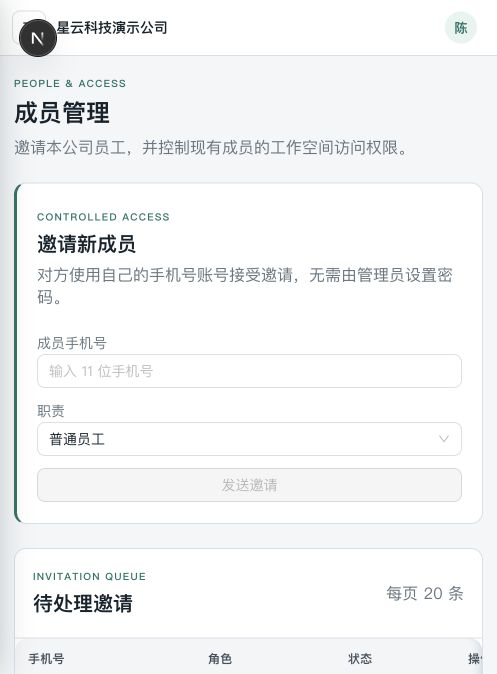

# CRM 三角色功能、剩余问题与交付检查 v1

日期：2026-09-09。基线：`297ad7a`，包含本轮 `codex/crm-polish-followups` 工作区修复。本文优先于较早审核中关于“当前无阻断”的推断。上轮修复明细见 [implementation.md](implementation.md)，原始问题见 [review.md](review.md)。

**结论：已有可试用的配置平台和个人工作闭环，但目前不能宣布公司开通链路通过，也不能宣布生产就绪。此次补查确认创建公司在独立环境失败，另有邀请撤销竞态风险。先修这两项，再补管理员交接与离职业务交接。短信和 AI 继续后置。**

## 1. 证据与验证边界

| 检查 | 结果 |
|---|---|
| 上轮 Web 全量 | 59 文件 / 344 测试通过，后补抽屉 2 测试通过 |
| 上轮编译 | 全仓 typecheck、API build 通过；新增测试后 Web typecheck 再通过 |
| 上轮数据库 | 13 个迁移可部署；动态记录、CSV 幂等、个人跟进权限/并发 E2E 通过 |
| 本轮角色单元测试 | tenants service/repository、memberships service、workspace guard 共 4 套 / 28 测试通过 |
| 本轮开通 E2E | platform-tenants 与 onboarding 两套、两项均失败：创建公司返回 500，Prisma P2011 |
| 排除测试框架干扰 | 用普通 Node 加载实际 database/dist 客户端，在同一独立 PostgreSQL 18 库创建 Tenant：不传 id 失败；显式传 id 成功 |
| 本地实际 API | 公司管理员：平台接口403，本公司成员/邀请/个人待办200。员工：平台/成员/邀请403，个人待办200 |
| 浏览器 | 公司管理员访问 /platform 被转回本公司首页；成员管理页面可读。未获得超级管理员浏览器登录，平台完整人工走查未完成 |
| 代码审查 | 分别检查标准/隔离机制和角色需求；新增跟进、CSV 幂等、首管续期未发现已证实的新越权阻断 |

测试使用独立临时数据库，无演示库重置、无正式账号提权。迁移成功与部分 E2E 通过不代表全部创建路径可用；上一轮为动态记录测试显式提供 fixture ID，没有覆盖此次失败的真实公司创建路径。

## 2. 三种角色各自应做什么

| 角色 | 已有功能 | 必须保持的权限边界 | 主要不足 |
|---|---|---|---|
| 超级管理员 | 公司列表搜索/状态筛选、公司详情、创建、启用/暂停/关闭、首管邀请续期；模板草稿/发布/应用；平台日志、操作记录、配置状态 | 管平台和公司生命周期，不自动成为各公司业务成员；不能无审计代管 | 创建公司阻断待修；首管手机号纠错；管理员交接/救援；模板升级、真实运行监控和失败任务中心 |
| 公司管理员 | 本公司成员邀请/启停、访问范围；对象/字段/权限/发布；多工作台；记录/导入导出/批量修改；个人跟进 | 仅本公司；保护最后一位有效管理员；配置变更经过发布生效 | 邀请撤销竞态；角色升降/交接；公司审计页；离职前记录和待办交接；团队待办汇总 |
| 员工 | 获授权业务对象、OWN/ALL范围、可读/可写字段、列表搜索筛选排序、详情/活动、允许的写入和导入导出、个人跟进 | 无平台管理及公司成员管理权；按发布快照和成员覆盖执行；越权应服务端拒绝 | 任务交接、常用筛选保存、业务对象关联/转换、真实附件；移动端需要继续按角色验证 |

不要给超级管理员常驻租户业务读写权来补运营功能；如果以后需要代管，独立设计公司授权、限时会话、用途、审计与退出。公司管理员的团队任务也不能靠绕过记录权限实现。

## 3. 当前问题清单

### P1-01：创建公司在当前独立运行环境失败（已复现，未修复）

- 触发：平台账号调用 `POST /api/v1/platform/tenants`。
- 结果：两套 E2E 都在创建处收到500，数据库报告 `P2011 Null constraint violation`。
- 定位：[tenants.repository.ts](../../../apps/api/src/modules/tenants/tenants.repository.ts) 的 createTenant 直接传 name/code；[schema.prisma](../../../packages/database/prisma/schema.prisma) Tenant.id 使用 `@default(uuid(7))`（当前174行）。普通 Node 调用同样失败，显式 ID 对照成功。
- 结论范围：已证实当前客户端/迁移/运行组合下默认 ID 路径有问题；尚未定位到具体依赖内部原因，不能据此断言所有部署都失败，也不能当成纯测试夹具问题忽略。
- 验收要求：修复真实创建路径；排查邀请、成员等其他依赖默认 ID 的创建路径；全新库和实际 API 完成“创建→接受→启用”。不要只给测试夹具补 ID 来让该链路变绿。

### P1-02：撤销邀请与接受邀请存在状态竞态（代码证实，待并发复现/修复）

- 撤销先读 PENDING，再按 id 无条件 update；接受端有邀请锁，会创建有效成员并标 ACCEPTED。
- 若撤销读完后等待接受提交，随后可把 ACCEPTED 覆盖成 REVOKED，而成员已经有效。重发路径也使用同一无条件写入。
- 证据：[memberships.service.ts](../../../apps/api/src/modules/memberships/memberships.service.ts) 341–345；[memberships.repository.ts](../../../apps/api/src/modules/memberships/memberships.repository.ts) 335–342；[invitations.repository.ts](../../../apps/api/src/modules/invitations/invitations.repository.ts) findOwned 行锁。
- 验收要求：以事务锁或 PENDING 条件更新保证只能一个状态转换胜出；冲突明确返回；并发接受/撤销/重发测试覆盖，不产生误导审计。

### P2：首位管理员填错手机号没有纠错流程

续期保留原手机号是当前安全边界，但错误号码会让草稿公司无法继续正常开通。需要“撤销旧邀请并更换目标”的明确操作，只允许无有效管理员的草稿公司；旧邀请失效且留下审计。证据：TenantsService.renewFirstAdminInvitation 189行。

### P2：管理员交接和员工升降角色缺入口

成员更新接口只有 ACTIVE/DISABLED；邀请已有员工为管理员，接受逻辑仍沿用既有 member，不升级 role。应明确禁止或提示重复成员邀请；角色变更需独立接口、最后管理员保护及审计。证据：[memberships.controller.ts](../../../apps/api/src/modules/memberships/memberships.controller.ts) 142行、[invitations.service.ts](../../../apps/api/src/modules/invitations/invitations.service.ts) 110行。

### P2：离职/记录转交后的待办可能无人接手

当前待办要求“本人 assignee 且仍有记录权限”。员工停用或记录转交后，原待办可能从工作视图消失；公司管理员不会自动看到别人的个人任务。这符合本轮个人功能范围，但不满足团队交接。应增加停用前影响预览、记录及待办交接、必要的取消原因。证据：[follow-ups.repository.ts](../../../apps/api/src/modules/follow-ups/follow-ups.repository.ts) list 的 member 和 scope 过滤。

### P2：公司审计等页面仍有占位

`workspace/[tenantCode]/audit`、`statistics`、`import-export` 使用 PagePlaceholder。记录列表里的 CSV 与工作台统计已可用，不应把这些页面当作独立中心已完成。优先接公司审计，其他入口明确能力位置。

### P2/P3：平台运营页面需要更诚实、易读

- 运行状态中 Redis READY 只表示 URL 已配置，不能称为连通性探测或监控。证据：[platform-operations.service.ts](../../../apps/api/src/modules/platform-operations/platform-operations.service.ts) 45/62行。
- 日志中文映射多为 `TENANT_CREATED` 等大写，而实际事件如 `platform.tenant.created`、`invitation.revoked`，部分内容会回退为原始代码；资源/操作者缩略 ID 也不够便于定位。证据：[platform-operations.tsx](../../../apps/web/src/features/platform/platform-operations.tsx) actionLabels/resourceLabels。
- “操作记录”目前主要是成功模板应用，不是包含失败、重试和耗时的后台任务中心。保留明确命名；未接任务队列前不要提供假进度。

## 4. 超级管理员逐页检查结论

| 页面 | 当前实现 | 补齐重点 |
|---|---|---|
| 总览 | 公司状态数量、待处理入口、日志入口 | 真实待处理原因与失败事项；数量能点到对应筛选结果 |
| 公司管理 | 名称/代码/状态筛选与分页 | 创建链路 P1；目标管理员纠错、关闭后数据处置与恢复政策 |
| 公司详情 | 公司状态、有效管理员、邀请、发布对象、生命周期操作 | 管理员交接；配置完成状态不能只靠固定步骤提示 |
| 模板 | 草稿、预览、发布、初始化公司 | 版本差异、升级已初始化公司、冲突处理；模板不是开通前置条件 |
| 日志中心 | 服务端过滤和分页 | 中文事件、操作者/公司可识别信息、必要详情、可追溯请求编号 |
| 操作记录 | 成功模板应用记录 | 明确现有范围；以后补失败/重试/幂等 |
| 系统设置 | 环境/数据库/Redis/短信配置状态展示 | 区分“配置齐备”和“健康”；生产备份恢复、告警另外验收 |

以上是源码与服务测试检查，不冒充超级管理员浏览器全流程验收。

## 5. 使用路径及页面观察

1. **公司管理员访问平台入口：符合边界。** 当前普通公司管理员被转回公司工作台；API平台接口403。
2. **公司管理员成员管理：基础可用、交接能力不足。** 邀请表单、邀请列表、成员启停/访问权限存在，缺角色升降。窄屏仍是多列表格，建议后续验证末列操作可达性；截图只能证明当前首屏，不代表整页无障碍合规。
3. **员工访问管理 API：符合边界。** 成员/邀请403，自己的跟进200；上轮已验收员工列表/个人跟进，见 implementation。此次未重复整个员工浏览器流程。
4. **超级管理员创建到启用：未通过。** 测试停在创建公司500；实际超级管理员页面会话尚未获得，后续步骤不能记为已验收。

## 6. 建议下一轮顺序及验收标准

1. **可靠性**：修默认ID创建路径及邀请竞态。两套开通E2E通过，新增竞争状态用例通过；不能以单元测试替代真实数据库验证。
2. **管理闭环**：首管手机号纠错、成员角色变更、管理员交接、离职记录/待办交接。至少保留一名管理员，旧授权及时失效，每步有审计。
3. **日常可用性**：公司审计页、团队待办与逾期汇总、日志可读性、成员手机操作。逾期先保留“到期且未完成”的简单定义，无需自动联系客户。
4. **业务深化**：对象关联、线索转换/状态规则、附件和个人视图，按实际业务需求逐项做。
5. **后置**：短信审核通过再接供应商；AI 后续独立设计读权限、写入建议与人工审批，当前不实现。

## 7. Standards / Spec 分轴结论

**Standards：** 新增跟进的事务记录锁/权限重检/乐观锁、导入幂等与RLS、首管续期权限边界未发现已证实的新违规。旧交接文档 Git 状态有冲突，本次更正。个人任务交接属于明确记录的范围限制，非越权修复。

**Spec：** 本轮修复与短信/AI后置符合用户要求；现有公司开通未通过实际验证，邀请竞态待修，管理员交接、手机号纠错、租户审计等未完成。没有用完成度百分比替代上述证据。

## 8. Git 交付范围

提交上轮业务修复、迁移、生成契约、测试和本次审查文档到功能分支 `codex/crm-polish-followups`，不合并 main、不部署。保留新发现问题及失败验收结果，不能把此次 push 解释为生产发布。排除本地环境、会话文件、工具索引/工作树和用户未要求提交的设计草稿。提交与远端 SHA 以本次任务最终回执为准。
